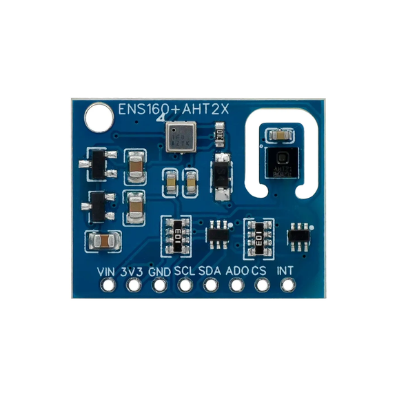
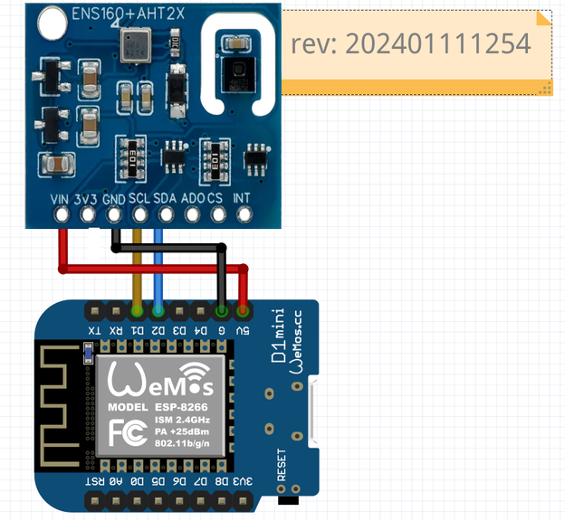
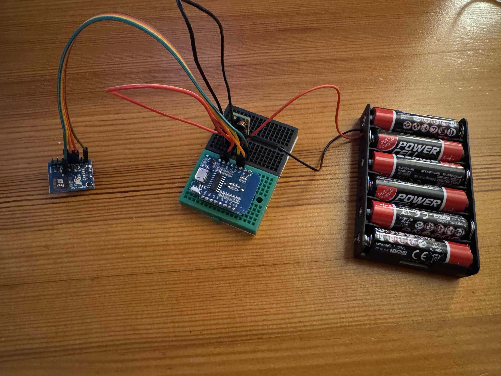
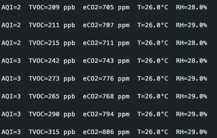
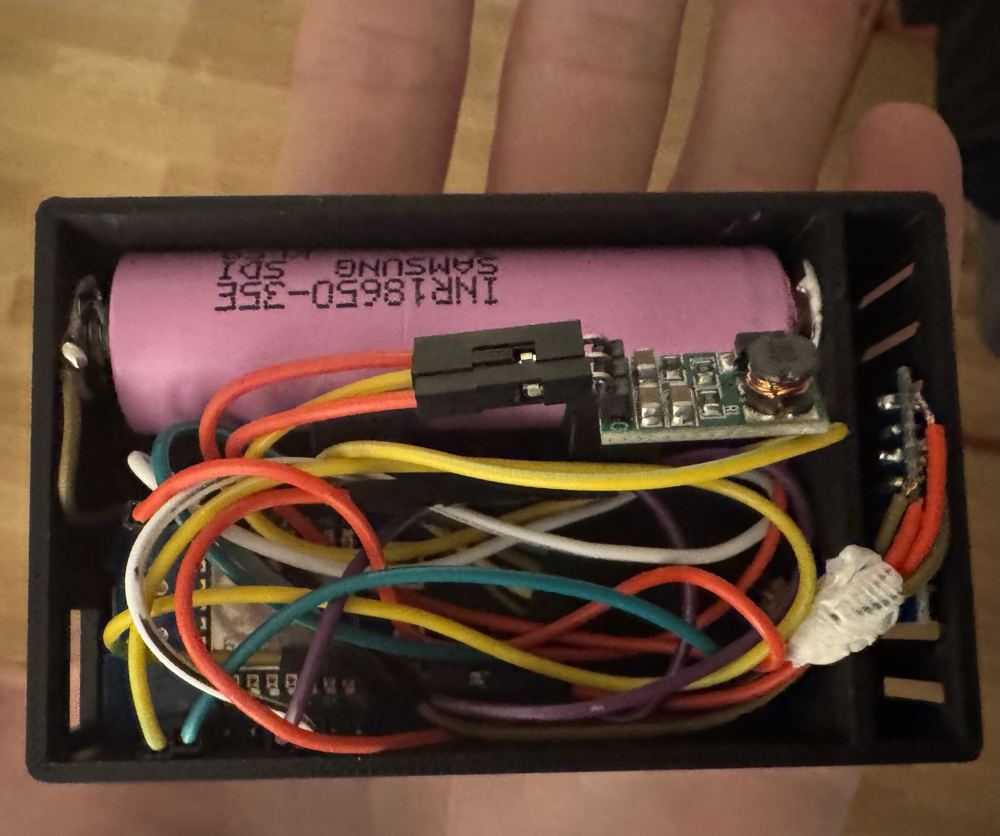
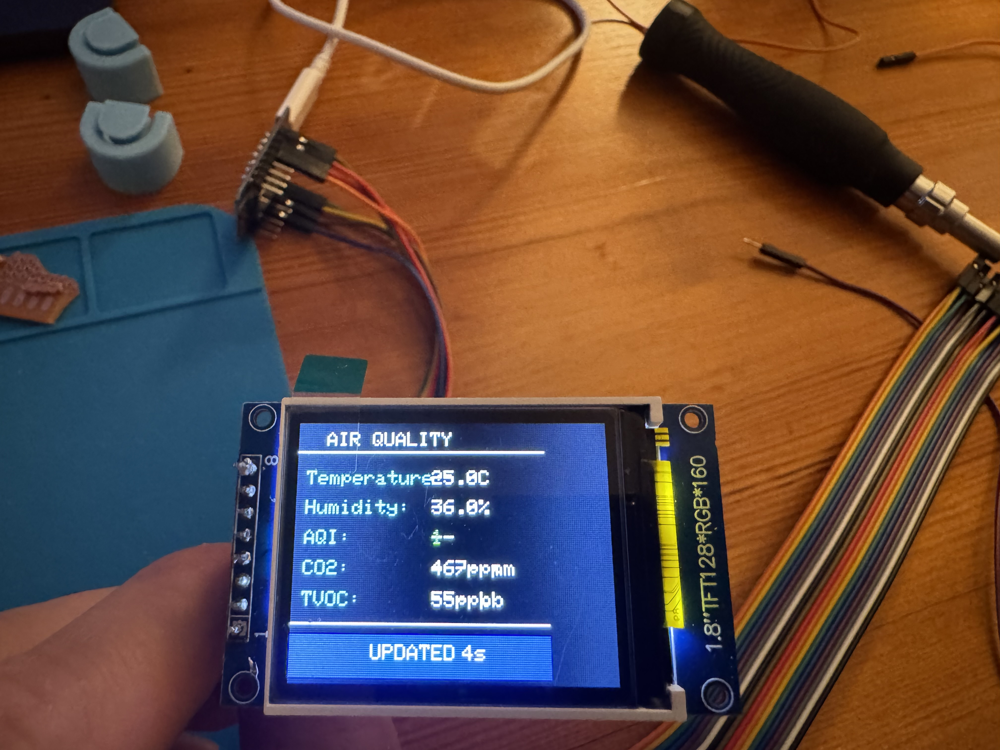

# ENS160 Sensor



**Figure 1.** Here is our little cheap hero.

[🛒 **AliExpress Link of the Sensor**](https://de.aliexpress.com/item/1005009070352900.html?spm=a2g0o.order_list.order_list_main.11.7e121802fccWTp&gatewayAdapt=glo2deu)


I couldn’t find much clear information or working examples online for this specific ENS160 combo sensor, especially when using it with boards like the Wemos D1 mini. Most tutorials were either outdated or incomplete, so I decided to build and document a clean, fully tested setup myself — including wiring, libraries, and working code — to make it easier for others to get reliable readings right away.

Minimal and **fully working** setup for the combined air quality and temperature/humidity sensor board:

- **ENS160** → Air Quality Index (AQI), Total Volatile Organic Compounds (TVOC, ppb), Equivalent CO₂ (eCO₂, ppm)  
- **AHT20 / AHT21 (AHT2x)** → Temperature (°C) and Relative Humidity (%)

Tested with **Arduino UNO R4** — can easily be adapted to ESP32.

---

## Overview

This project shows how to:
- Read real-time **air quality**, **TVOC**, and **eCO₂** values  
- Use **AHT21** readings for temperature/humidity compensation  
- Display all data via the Arduino Serial Monitor
- Most importantly **wiring**.
---

## Wiring

| ENS160 + AHT2x Module | Arduino UNO R4 | Description |
|:----------------------|:------------------------|:-------------|
| **VIN** | **3V3** | Power (3.3V / 5V) |
| **GND** | **G** | Common ground |
| **SCL** | **SCL** | I²C Clock |
| **SDA** | **SDA** | I²C Data |

> Rest of the pins are for the special cases



**Figure 2.** In this image wiring is shown with the Wemos D1 mini (ESP8266).


## Required Libraries

Install from **Arduino IDE → Library Manager**:

| Library | Purpose |
|:--------|:---------|
| **Adafruit AHTX0** | For AHT20/AHT21 temperature & humidity |
| *(optional)* **ScioSense ENS160** | For ENS160 high-level API (some boards use modified forks) |

## 📡 Wireless ESP-NOW Extension (ESP8266)

After confirming stable **ENS160 + AHT21** readings over I²C, I extended the project to work completely 
**wirelessly** using **ESP-NOW** on two Wemos D1 mini boards.  

This setup turns one board into a **sensor node (TX)** and another into a **receiver (RX)** that logs and 
displays data — **no Wi-Fi network or internet required**.

---

### 🧱 Data Packet Structure

```cpp
typedef struct __attribute__((packed)) {
  uint8_t  aqi;          // Air Quality Index (1–5)
  uint16_t tvoc;         // Total VOC (ppb)
  uint16_t eco2;         // Equivalent CO₂ (ppm)
  float    temperature;  // °C
  float    humidity;     // %RH
} AirData_t;
```

✅ **Compact (13 bytes)** – efficient for ESP-NOW transmission  
✅ **Binary-safe** – no `String` or text parsing  
✅ **Identical structure** on both sender and receiver sides  

---

### 🧩 How It Works

1. The **sender (TX)** reads ENS160 + AHT21 data and transmits an `AirData_t` packet via ESP-NOW.
2. The **receiver (RX)** listens for packets and prints incoming readings in a clean, human-readable format.  
3. Both devices operate on **Wi-Fi channel 1**, and the sender is paired to the receiver’s **AP MAC address**.

This extension effectively turns the ENS160 module into a **wireless air-quality telemetry node** that can 
feed data to dashboards, displays, or data loggers — **no cables, no router, just power.**



**Figure 3.** Transmitter Setup.




**Figure 4.** Outputs via ESP NOW


---

## 🛠️ Next Steps

I plan to:

- 🧾 **3D-print a compact case** for both transmitter and receiver units.   **DONE ✅**
- 🖥️ **Add an OLED or TFT display** to the RX side for real-time AQI, eCO₂, temperature, and humidity.  **DONE ✅**
- 📈 **ESP Deep Sleep**, I just discovered how low power needed while using with the Deep-Sleep. This way I can put the 
TX side to my balcony and totally forget about it. 3 or 4 data packages a day is more than enough to monitor the weather
changes in long time. IN PROGRESS ☑️
-----------

## Latest updates

- Printed a compact case for the TX side housing. 



**Figure 5.** Wiring looks messy I know but I didn't wanna solder the parts for using them in future.




**Figure 5.** TFT Display shows the real time data coming from the TX case.


📘 Source

Based on: [Instructables](https://www.instructables.com/ENS160-AHT21-Sensor-for-Arduino/)
Extended, cleaned, and tested with ESP8266 + ESP-NOW wireless telemetry by Me
